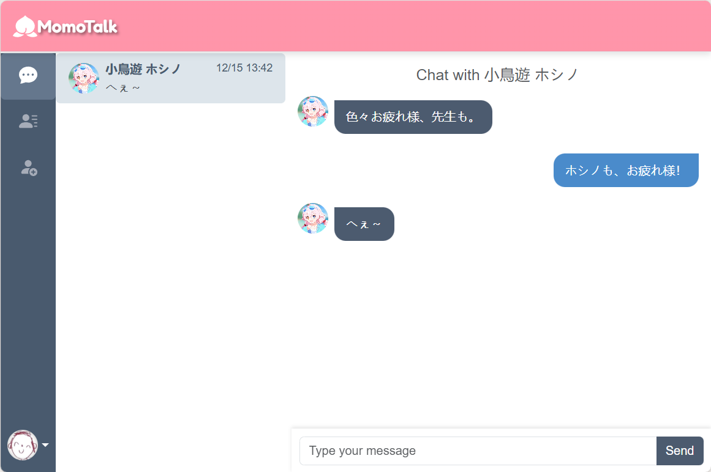

<div align="center">
  
</div>

<div align="center">
  
</div>

## English

### About
Momotalk is a social messaging platform that allows users to send messages, manage friends, and enjoy real-time interactions with Socket.IO. This project uses a Node.js backend with a MySQL database and a React.js frontend for the client-side.
Looks just like Momotalk in BlueArchive, but with more features! 

This is my first time using React to write a webapp that needs to use sockets, and there are many bugs, problems, and missing features. (BTW, this is the Final Project for a course in college, and I think it's quite fun, so I plan to continue to work on some features)

### Features
- **Real-time Messaging**: Send and receive messages instantly using Socket.IO.
- **Friend Management**: Add, accept, and remove friends.
- **Authentication**: Secure login and registration with JWT.
- **Profile Customization**: Update user profiles including avatars and nicknames.
- **BLUEARCHIVE!**: Looks like Momotalk in BlueArchive!

### Tech Stack
- **Backend**: Node.js, Express.js, Socket.IO, MySQL
- **Frontend**: React.js, Axios
- **Database**: MySQL
- **Authentication**: JWT (JSON Web Tokens)
- **Styling**: Bootstrap, CSS/Custom Styles

### Installation

#### Prerequisites
- Node.js (v16.x or later)
- MySQL (v8.x or compatible)
- npm or yarn

#### Backend Setup
1. Clone the repository:
    ```bash
    git clone https://github.com/Japerz12138/MomoTalk.git
    ```
2. Install dependencies:
    ```bash
    npm install
    ```
3. Configure `.env`:
    ```env
    DB_HOST= YOUR_DB_HOST
    DB_USER= YOUR_DB_USER
    DB_PASSWORD= YOUR_DB_HOST
    DB_DATABASE= YOUR_DATABASE
    CLIENT_DOMAIN= DOMAIN_YOU_GONNA_HOST
    ```
4. Start the server:
    ```bash
    node server.js
    ```

#### Frontend Setup
1. Start the development server:
    ```bash
    npm start
    ```

#### Database Setup
1. Create a MySQL database named `momotalk`. (Or the query will help you do it)
2. Import the provided `query.sql` file:
    ```bash
    mysql -u root -p momotalk < query.sql
    ```

### Usage
1. Open your browser and navigate to the site.
2. Register or log in to start chatting with friends.

---

## 中文

### 关于
Momotalk 是一个以《蔚蓝档案》手游中的虚拟聊天平台《MomoTalk》为灵感而制作的社交消息平台，用户可以通过 Socket.IO 实现实时消息收发、好友管理以及互动交流！后期还会支持比如像是亲密度Event的整活儿内容XD

这是我第一次使用React写需要使用socket的webapp，有非常多的BUG和问题以及缺失的功能。（其实这个是大学的一个课程的Final Project，觉得还挺好玩的，所以打算继续做一些功能）

### 功能
- **实时消息**：通过 Socket.IO 实现消息的即时发送与接收。
- **好友管理**：支持添加、接受和删除好友功能。
- **用户认证**：使用 JWT 确保登录与注册安全。
- **个人资料定制**：支持修改头像和昵称。

### 技术栈
- **后端**：Node.js, Express.js, Socket.IO, MySQL
- **前端**：React.js, Axios
- **数据库**：MySQL
- **认证**：JWT（JSON Web Token）
- **样式**：Bootstrap, CSS/自定义样式

### 安装步骤

#### 前置条件
- Node.js (v16.x 或更高)
- MySQL (v8.x 或兼容版本)
- npm 或 yarn

#### 后端设置
1. 克隆项目代码：
    ```bash
    git clone https://github.com/Japerz12138/MomoTalk.git
    ```
2. 安装依赖：
    ```bash
    npm install
    ```
3. 配置 `.env` 文件：
    ```env
    DB_HOST= YOUR_DB_HOST
    DB_USER= YOUR_DB_USER
    DB_PASSWORD= YOUR_DB_HOST
    DB_DATABASE= YOUR_DATABASE
    CLIENT_DOMAIN= DOMAIN_YOU_GONNA_HOST
    ```
4. 启动服务：
    ```bash
    node server.js
    ```

#### 前端设置
1. 启动开发服务器：
    ```bash
    npm start
    ```

#### 数据库设置
1. 创建名为 `momotalk` 的 MySQL 数据库。(query也会创)
2. 导入提供的 `query.sql` 文件：
    ```bash
    mysql -u root -p momotalk < query.sql
    ```

### 使用方法
1. 打开浏览器并访问。
2. 注册或登录后即可开始与好友聊天。

---

### Contributing | 贡献
Feel free to fork this repository and submit pull requests for new features or bug fixes.

欢迎 Fork 此代码库并提交 Pull Request！也请各路大佬们多多指教！

---

### 许可

If you think my function is not well written and only think the interface is okay, please feel free to use it.

我也知道我这代码写的很拉，如果你要是只觉得我这个界面做的不错，也请随意拿去给自己的project用！（如果要是能给的credit就好力）
